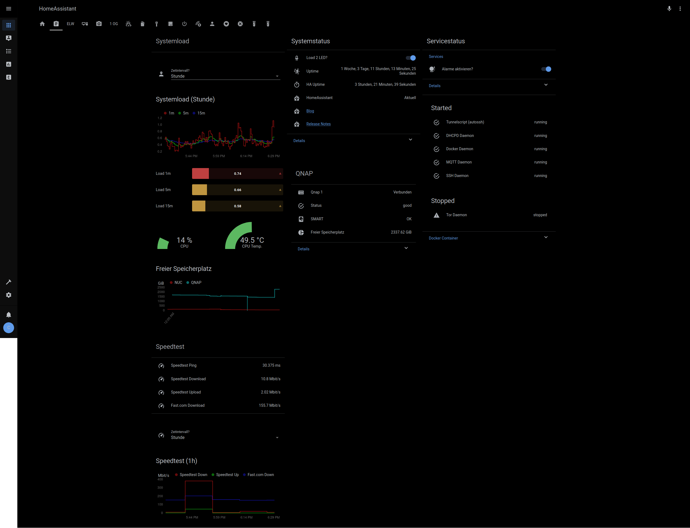
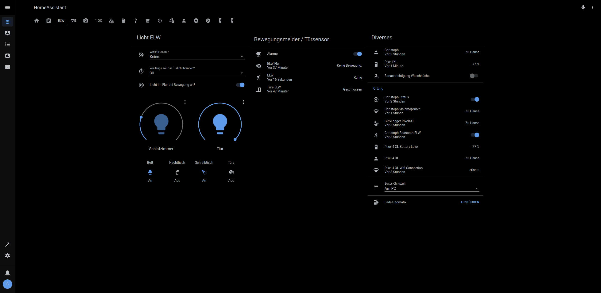
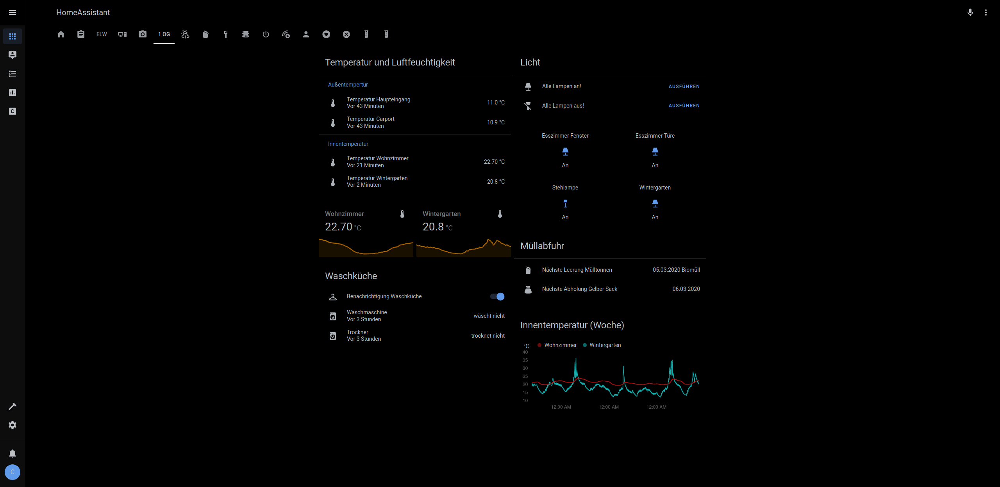
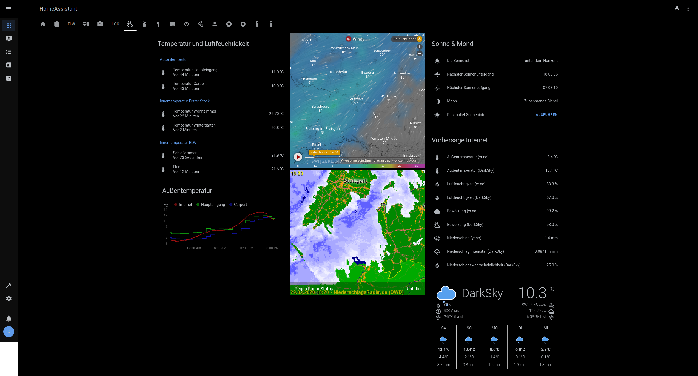
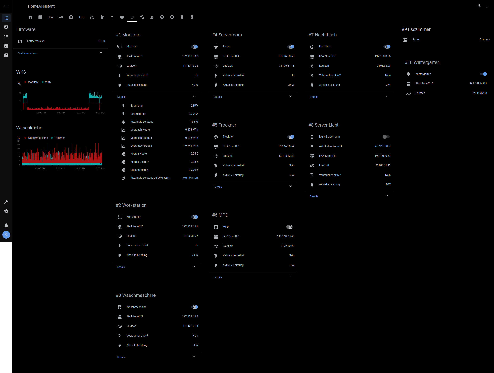

# Home Assistant Setup

This repo contains the configuration for my [Home Assistant](https://www.home-assistant.io) installation.

Information about the original setup and VENV installation can be found on my [blog](https://chris.0x711.de).

Comments and Questions highly appreciated!
c.github[at]0x711.de / cvoid#4858 on [Discord HA Server](https://discord.gg/c5DvZ4e).

## Host
### Intel NUC (NUC7i3BNH)

I moved from a Raspberry Pi3 to an [Intel NUC](https://www.intel.com/content/www/us/en/products/boards-kits/nuc/kits/nuc7i3bnh.html), with 8GB of RAM, Gigabit Ethernet and a Samsung 850 Evo SSD.

System Load with HomeAssistant, various Docker Containers, autossh bridges and other services is moderate. All time laod average is below 0.6.

### VENV / Services
I am running HomeAssistant in a [virtual environment](https://www.home-assistant.io/docs/installation/virtualenv/).
The initial basic setup is documented [here](https://chris.0x711.de/index.php/2018/01/31/setting-up-home-assistant-in-a-virtual-environment-on-intel-nuc/).

## Hardware
HomeAssistant supports a huge and growing variety of components. See  [here](https://www.home-assistant.io/integrations) for an overview.

Components I use:
* [Unifi Nano HD WiFi AP](https://unifi-hd.ui.com/)
* [Aeotec Z-Wave Controller](https://aeotec.com/z-wave-usb-stick/)
* [Aeotec Z-Wave Multisensor](https://aeotec.com/z-wave-sensor/)
* [Fibaro Z-Wave WallPlug](https://www.fibaro.com/en/products/wall-plug/)
* [Ikea TRÅDFRI](https://www.ikea.com/us/en/catalog/categories/departments/lighting/36812/)
* [Sonoff POW R2](https://www.itead.cc/sonoff-pow-r2.html) with [Tasmota](https://github.com/arendst/Tasmota)
* [Delock Wifi Plugs](https://www.delock.de/produkte/1744_Geraete/11826/merkmale.html)
* Various ESP32/8266 Boards with [ESPHome](https://esphome.io/) (My [ESPHome repository](https://github.com/bl0rp/esphome-config))

## Other Services
* [HA-Dockermon](https://hub.docker.com/r/tribunex/ha-dockermon-pi/) provides a REST-API to restart docker container
* [Watchtower](https://github.com/containrrr/watchtower) for automatic container updates
* InfluxDB stores timeseries data
* Grafana to visualize the collected data from InfluxDB
* Mosquitto as a MQTT broker for ESPHome and Sonoffs
* Unifi Controller for managing WiFi APs

## Screenshots

